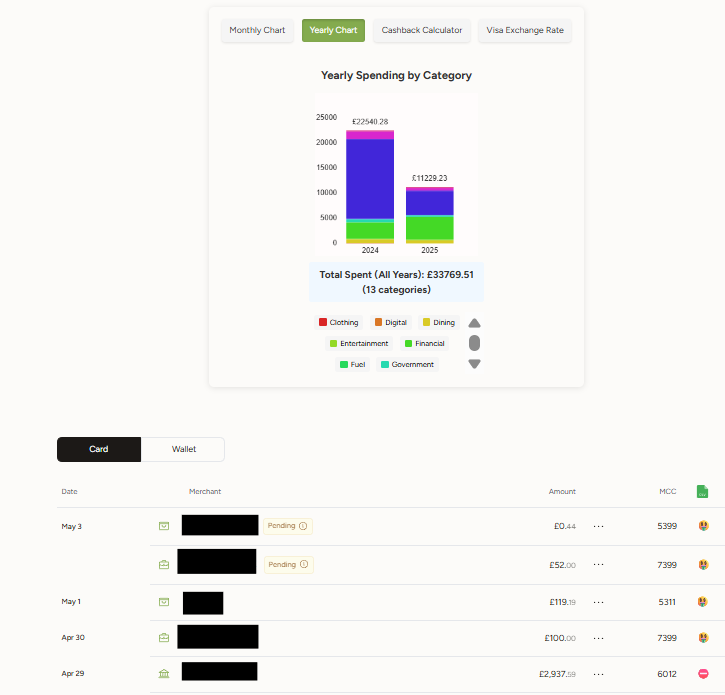

# gnosispay-dashboard-extension
A browser extension that enhances the GnosisPay dashboard with transaction analysis features.

## About me

I have been a DeFi user for a fairly long time, and I'm most notably a member of Harvest's team ([harvest.finance](https://www.harvest.finance/)). I have no association with Gnosis Pay's team. Feel free to reach out on Twitter ([@_kobrad](https://x.com/_kobrad)) or Discord (.kobrad)

## Disclaimer

This extension's purpose is to enhance the UI and give access to information that is mostly available via API.
I have no access to your data as this runs in your browser however, a few words of caution are still necessary:
1. Not everyone on Web3 is here to help you. I might even say that there are more malicious agents than not. Hence, be very vigilant, especially when using code from third parties.
2. If you do want to use external code, it would be better to read the code first (or at least verify via AI if this is dangerous in any way). The code for the extension is contained within `content.js`. You're more than encouraged to have a look at the code.
3. This code will work as intended, as it is within a vanilla environment. If you make changes or add further extensions, I cannot guarantee that things won't break or sensitive data may become accessible (in particular if extensions are made on purpose by malicious agents). As always, be cautious. 

## Features

- **Spending Analysis**: Visualise spending by category with interactive pie charts
- **Yearly Overview**: View spending trends over time with histogram charts
- **Cashback Calculator**: Estimate potential cashback earnings
- **MCC Insights**: See merchant category codes and cashback eligibility
- **Data Export**: Export transaction history to CSV

## Installation

### Chrome/Edge/Brave

1. Download this repository
2. Go to `chrome://extensions/`, `edge://extensions/`, `brave://extensions/`
3. Enable "Developer mode"
4. Click "Load unpacked" and select the `/extension` folder

### Firefox

1. Download this repository
2. Go to `about:debugging#/runtime/this-firefox`
3. Click "Load Temporary Add-on"
4. Select any file in the `/extension` folder

## Usage

1. Log in to your GnosisPay account at https://app.gnosispay.com/
2. Navigate to the Card section
3. The extension will automatically enhance your transaction view with:
   - MCC codes and cashback eligibility indicators
   - Spending analysis charts
   - Cashback calculation tools

## Features in Detail

### Enhanced Transactions list
- Displays MCC code next to transactions
- With emojis shows if they earn cashback
- CSV exporter by clicking the csv icon

### Spending Analysis
- Monthly breakdown by category
- Interactive category highlighting (if you click on an item in legend, you highlight corresponding transactions)
- Total spending summary

### Yearly Overview
- Annual spending trends
- Category comparison across years
- Interactive category highlighting (if you click on an item in legend, you highlight corresponding transactions)

### Cashback Calculator
- Select a week to analyze
- Enter your GNO token amount
- Toggle OG NFT ownership
- See estimated cashback amount and rate

### Visa Exchange Rate
- Link to page with Visa Exchange Rate (edit bank fee to 0% to have correct rate for Gnosis Pay)

## Development

To modify or extend the extension:

1. Clone this repository
2. Make changes to `content.js`
3. Test by reloading the extension in your browser
4. Submit a pull request with your improvements

## License

MIT License
